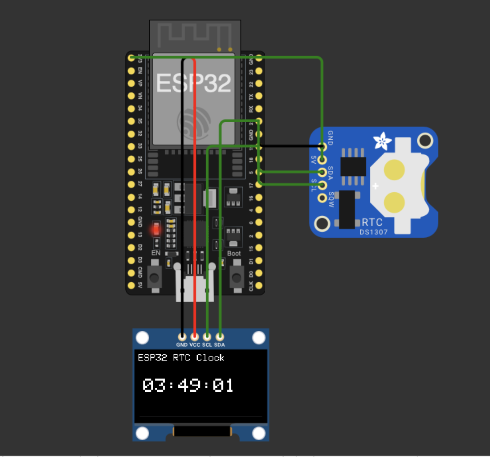

# ESP32 RTC Digital Clock

## Overview

This repository contains an **ESP32-based digital clock** implementation using a **DS1307 Real-Time Clock (RTC)** module and an **SSD1306 OLED display**.  
The project demonstrates reliable timekeeping in an embedded system without reliance on network connectivity or cloud services.

The clock reads time directly from the RTC module and displays it in real time on an OLED screen using the I2C bus.

---

## Purpose

The purpose of this project is to:

- Demonstrate RTC-based timekeeping on ESP32
- Showcase I2C device integration (RTC + OLED on shared bus)
- Implement a clean and readable embedded display interface
- Serve as a compact reference for ESP32 + RTC + OLED systems

This project is designed as a focused embedded implementation rather than a full-featured product.

---

## Hardware Components

- ESP32 development board
- DS1307 RTC module
- SSD1306 OLED display (128×64, I2C)
- Coin cell battery (CR2032) for RTC backup

---

## Demo

## Communication & Pin Configuration

- I2C Bus
  - SDA: GPIO 21
  - SCL: GPIO 19

Both the RTC module and OLED display operate on the same I2C bus.

---

## Features

- Accurate timekeeping using DS1307 RTC
- Time persistence across resets via RTC backup battery
- Digital time display in HH:MM:SS format
- OLED-based visual output
- No WiFi or internet dependency
- Minimal and stable embedded logic

---

## Implementation Notes

- The RTC time is initialized once using compile-time values if the RTC is not already running
- Subsequent resets do not overwrite stored RTC time
- The display refreshes at one-second intervals
- The design avoids unnecessary dependencies and background services

---

## Testing

- Verified in Wokwi simulation environment
- Functional validation of:
  - RTC initialization and time reading
  - OLED rendering and refresh
  - I2C communication stability
- Logic structured to behave consistently on real hardware

Further long-term accuracy testing can be performed based on application requirements.

---

## Possible Extensions

- Date display (DD/MM/YYYY)
- 12-hour time format option
- Alarm or timer functionality
- Migration to DS3231 for higher accuracy
- Power optimization for battery-operated setups

---

## Project By

**Hariom Sharnam**

---

